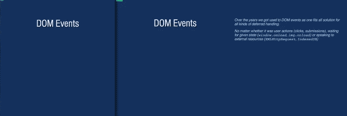

# bespoke-notes
## Notes for [Bespoke.js](https://github.com/markdalgleish/bespoke.js) presentations

Use cases:

- Publish slides with notes to those who were not able to see the presentation
- Write notes for presentation, and present it on two screens (with help of [bespoke-sync](https://github.com/medikoo/bespoke-sync)):  
Audience screen:                      Your screen:



See [Asynchronous JavaScript Interfaces](http://medikoo.com/asynchronous-javascript-interfaces/?notes) presentation for demo

### Usage

`bespoke-notes` uses `<aside>` elements as notes.

```html
...
<section>
  <h2>My Slide</h2>
  <aside>
    <p>My Notes</p>
  </aside>
</section>
...
```

```javascript
// If your CJS bundler supports CSS modules do:
notes = require('bespoke-notes');
// otherwise do following (end ensure that rules from style.css load in your browser)
notes = require('bespoke-notes/dom');

bespoke.from(selector, [
  notes()
]);
```

Possible options:
```javascript
bespoke.from(selector, [
  notes({
    key: 0x4e, // Key that toggles notes, default: 0x4e ('n' key)
    visible: false, // Whether to display notes on startup, default: false
  })
]);
```

Additionally notes display can be forced via `?notes` query in url search string

### Installation
#### npm

In your presentation path:

	$ npm install bespoke-notes
